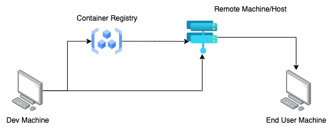

# Deploying Docker Containers

## From Deployment to Production

General rules to follow when moving from development to Production:

1. Bind Mounts should not be used in Production.
2. Containerized apps might need a build step (e.g React Apps)
3. Multi-Container projects might need to be split (or should be split) across multiple hosts/remote machines.
4. We'll see how the trade-offs between control and responsibility might be worth it.

## Deployment Example: Basic Node App

We will first start with a very simple standalone NodeJS App. The deployment approach used here will be to "Install Docker on a remote host (e.g via SSH), push and pull image, run container based on image on remote host."

So with this architecture, the first thing we need is a Docker hosting provider. For this example, we will be using a AWS EC2 Instance.

### Deploying to AWS
